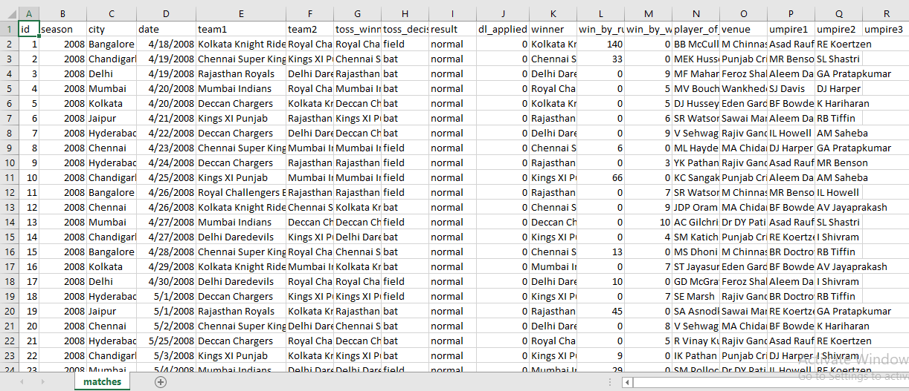
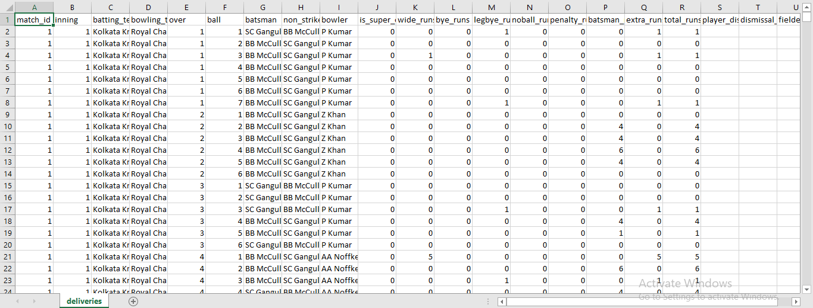
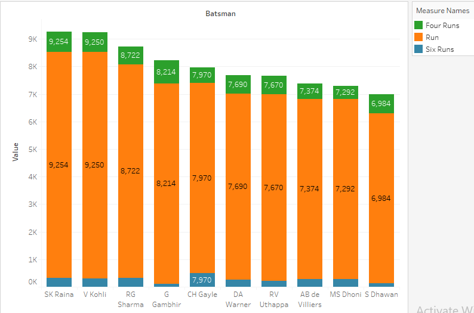
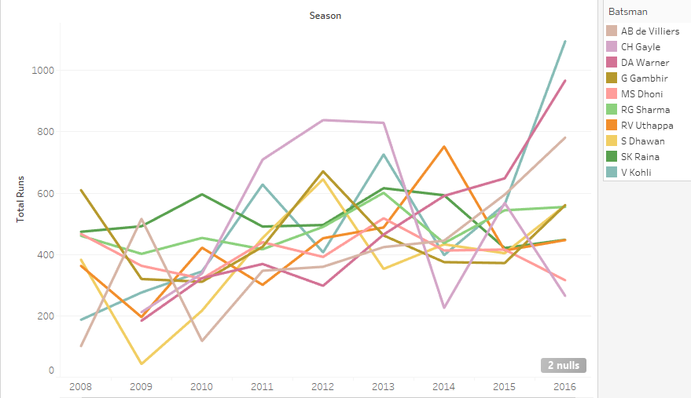

# IPL-Analysis
Datasets are extracted and loaded into Hive. The data is further processed, transformed, and analyzed to get the winner for each season and the top 5 batsmen with maximum run in each season and overall season

## Objective

These files are extracted and loaded into Hive. The data is further processed, transformed, and analyzed to get the winner for each season and the top 5 batsmen with maximum run in each season and overall season

## Data description

Two cricket data files with Indian Premier League data from 2008 to 2016 is used as a data source. The files are as follows:

matches.csv – Provides details about each match played
deliveries.csv – Provides details about consolidated deliveries of all the matches

  //matches.csv

   

  //deliveries.csv 

   

## Tools & technologies used

Best suited technologies:

1. Apache Hive

2. Apache Pig

3. Tableau

## Commands

1) Creating Database and Database Tables in Hive 

   a) Dropping Database 
   
       DROP DATABASE IF EXISTS ipl_data CASCADE;
       DROP DATABASE IF EXISTS ipl_stats CASCADE;

   b) Creating a Database 

       CREATE DATABASE ipl_data ;  -- Database for Loading CSV Input File  
       CREATE DATABASE ipl_stats ; -- Database for Loading stats tables

   c) Creating two tables to load input files ( matches and deliveries )

   //Matches Table

       CREATE TABLE ipl_data.matches(
       `id` int,
       `season` int,
       `city` string,
       `date` date,
       `team1` string,
       `team2` string,
       `toss_winner` string,
       `toss_decision` string,
       `result` string,
       `dl_applied` int,
       `winner` string,
       `win_by_runs` int,
       `win_by_wickets` int,
       `player_of_match` string,
       `venue` string,
       `umpire1` string,
       `umpire2` string,
       `umpire3` string)
        ROW FORMAT SERDE 'org.apache.hadoop.hive.serde2.OpenCSVSerde' 
        WITH SERDEPROPERTIES (
        "separatorChar" = ",",
        "quoteChar" = "\""
        )
        STORED AS TEXTFILE 
        TBLPROPERTIES (
        'serialization.null.format' = '',  
        'skip.header.line.count' = '1');
 
   // Deliveries Table

        CREATE TABLE ipl_data.deliveries(
       `match_id` int,
       `inning` int,
       `batting_team` string,
       `bowling_team` string,
       `over` int,
       `ball` int,
       `batsman` string,
       `non_striker` string,
       `bowler` string,
       `is_super_over` int,
       `wide_runs` int,
       `bye_runs` int,
       `legbye_runs` int,
       `noball_runs` int,
       `penalty_runs` int,
       `batsman_runs` int,
       `extra_runs` int,
       `total_runs` int,
       `player_dismissed` string,
       `dismissal_kind` string,
       `fielder` string)
        ROW FORMAT SERDE 'org.apache.hadoop.hive.serde2.OpenCSVSerde' 
        WITH SERDEPROPERTIES (
        "separatorChar" = ",",
        "quoteChar" = "\""
        )
        STORED AS TEXTFILE 
        TBLPROPERTIES (
        'serialization.null.format' = '',  
        'skip.header.line.count' = '1');

   d) Creating a table to load Actual data into Compressed file Format(ORC) table. 
   
   //Matches Table

        CREATE TABLE ipl_stats.matches(
       `id` int,
       `season` int,
       `city` string,
       `date` date,
       `team1` string,
       `team2` string,
       `toss_winner` string,
       `toss_decision` string,
       `result` string,
       `dl_applied` int,
       `winner` string,
       `win_by_runs` int,
       `win_by_wickets` int,
       `player_of_match` string,
       `venue` string,
       `umpire1` string,
       `umpire2` string,
       `umpire3` string)
        ROW FORMAT DELIMITED
        FIELDS TERMINATED BY ','
        STORED AS ORC ;

   //Deliveries Table

        CREATE TABLE ipl_stats.deliveries(
       `match_id` int,
       `inning` int,
       `batting_team` string,
       `bowling_team` string,
       `over` int,
       `ball` int,
       `batsman` string,
       `non_striker` string,
       `bowler` string,
       `is_super_over` int,
       `wide_runs` int,
       `bye_runs` int,
       `legbye_runs` int,
       `noball_runs` int,
       `penalty_runs` int,
       `batsman_runs` int,
       `extra_runs` int,
       `total_runs` int,
       `player_dismissed` string,
       `dismissal_kind` string,
       `fielder` string)
        ROW FORMAT DELIMITED
        FIELDS TERMINATED BY ','
        STORED AS ORC ;
   

2) Importing Data into Hive Tables

   a) Loading Input CSV File into ipl_data Database

       LOAD DATA INPATH 
       '/user/support1161/IPL/matches.csv' 
       INTO TABLE ipl_data.matches;

       LOAD DATA LOCAL INPATH 
       '/user/support1161/IPL/deliveries.csv' 
       INTO TABLE ipl_data.deliveries;

   b) Here we loading data to orc format table from text format table 
   
       INSERT OVERWRITE TABLE ipl_stats.matches 
       SELECT * FROM ipl_data.matches ;

       INSERT OVERWRITE TABLE ipl_stats.deliveries 
       SELECT * FROM ipl_data.deliveries ; 

3) Loading and Storing Hive Data into Pig Relation

        Run the Pig Script for the Analysis & computations(ipl.pig)

4) Storing the output in Hive Table

        CREATE TABLE ipl_stats.most_run (
        batsman string,
        season string,
        innings bigint,
        not_out bigint,
        run bigint,
        average double,
        strike_rate double,
        four_runs bigint,
        six_runs bigint
        )
        ROW FORMAT DELIMITED
        FIELDS TERMINATED BY ','
        STORED AS TEXTFILE ;

5) Tableau Visualisations

  a. Top 10 Batsmen with most runs  

   

  b. Top 10 Batsmen - Year wise runs 

   
  

